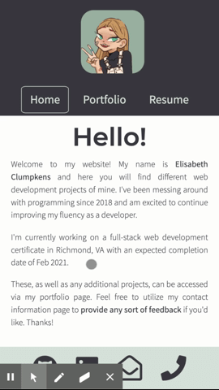

## My Portfolio

[eaclumpkens.github.io](http://eaclumpkens.github.io/)

Here I've created a simple portfolio page highlighting projects I created whilst completing the University of Richmond full-stack development course.

---

### Technologies

- HTML
- CSS / Reset CSS 
- BootStrap
- Font Awesome
- Google Fonts

---

### Screenshots 

##### Desktop

##### Mobile

